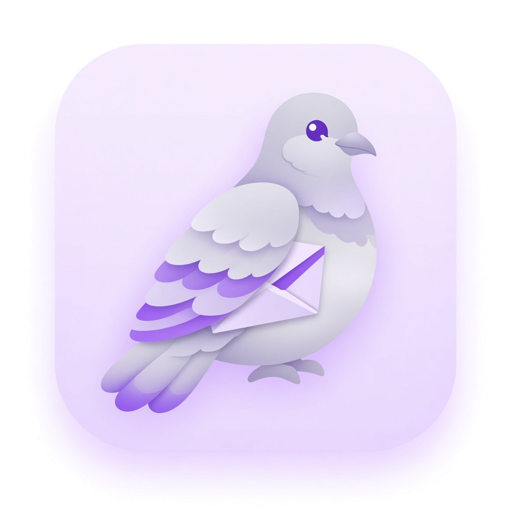

# Payra

Desktop realtime chat for SDP-2 — Python + PySide6 + Supabase, with a separate AI assistant later.

<p align="center">
  
</p>

**Payra** (পায়রা) means *pigeon* in Bangla — inspired by carrier pigeons that once delivered messages.

## Stack

- **UI:** PySide6 (desktop, Windows + macOS)
- **Backend:** Supabase Auth, Postgres, Realtime, Storage (images)
- **AI:** separate module / tables (not mixed into normal chat with an `is_ai` flag)

## Features (MVP)

- Login / register (no email verification)
- 1:1 and group chats
- Realtime text messages
- Image transfer (Supabase Storage)
- AI chatbot (phase 3, separate from human chats)

## Build order

1. UI design (Google Stitch) → implement screens
2. Supabase → auth, chats, groups, images
3. AI assistant

## Setup (macOS)

See team notes or run the Homebrew + venv commands from the project chat.

```bash
cd /Volumes/MAC_ST/mk/projects/payra
source .venv/bin/activate
python -m payra
```

## Project layout

```
payra/
  src/payra/          # application package
    ui/               # windows, widgets, styles
    services/         # supabase, auth, chat, storage, ai
    models/           # data shapes
    resources/        # logo, icons, images
  design/             # Stitch exports & design notes
  docs/               # architecture, schema notes
  requirements.txt
```
